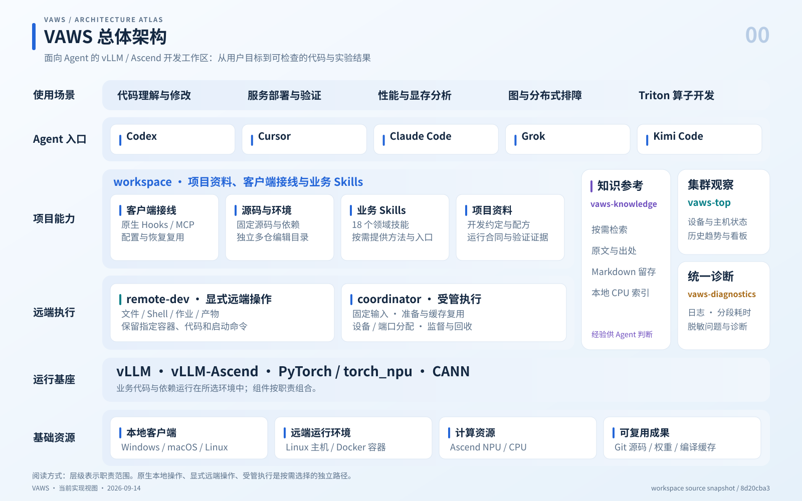
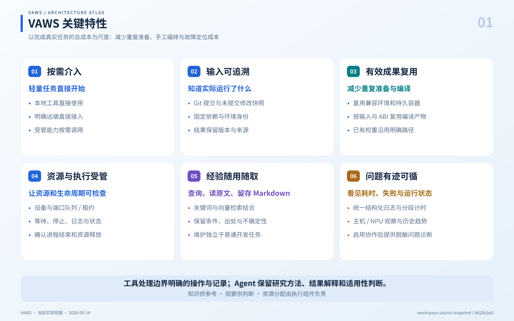
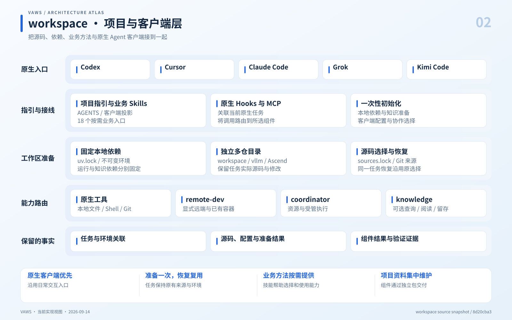
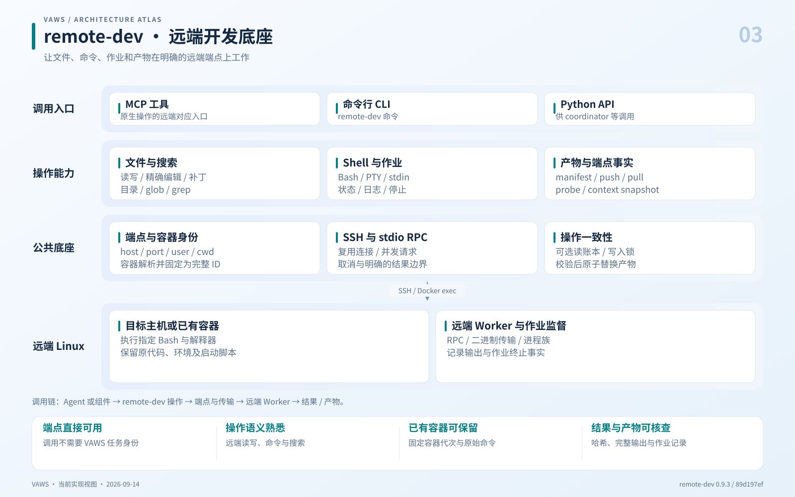
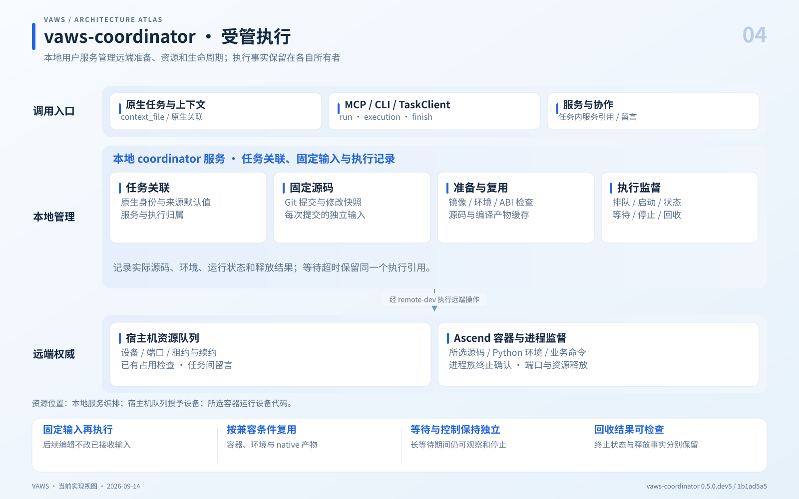
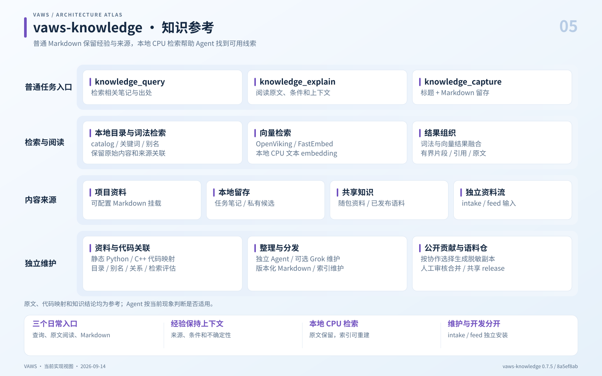
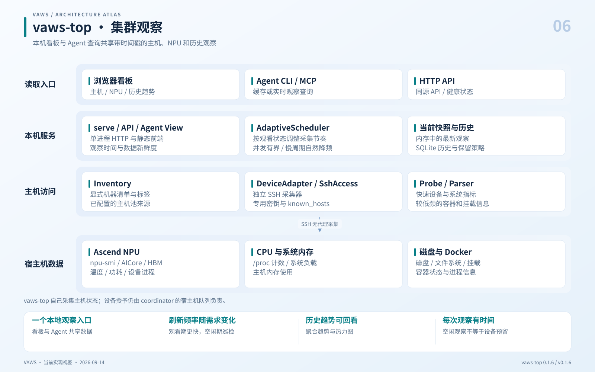
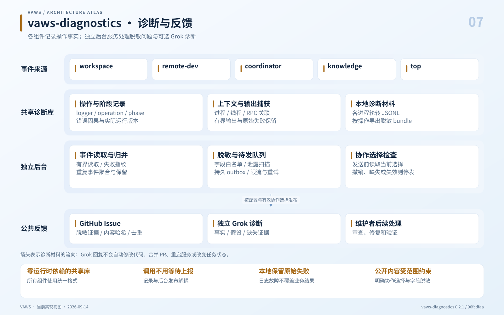

# VAWS 架构与关键特性图册

这套图面向首次了解 VAWS 的开发者。先看总体架构与关键特性，再按任务需要阅读组件图。

**范围：**下述基线中已实现的职责和机制；图示不是性能、业务正确性或全平台支持承诺。当前运行合同见 [target-state.md](../target-state.md)。

**基线：**2026-09-14，workspace `8d20cba36e3284ca307edfc5f7c53d045b12cad6` 及其锁定组件。独立 runtime 包与 workspace 消费层分开表达。

## 图册目录

| 图 | 内容 | 图片 | 可编辑矢量 |
|---|---|---|---|
| 00 | VAWS 总体架构 | [PNG](png/00-overview.png) | [SVG](svg/00-overview.svg) |
| 01 | VAWS 关键特性 | [PNG](png/01-key-features.png) | [SVG](svg/01-key-features.svg) |
| 02 | workspace · 项目与客户端层 | [PNG](png/02-workspace.png) | [SVG](svg/02-workspace.svg) |
| 03 | remote-dev · 远端开发底座 | [PNG](png/03-remote-dev.png) | [SVG](svg/03-remote-dev.svg) |
| 04 | vaws-coordinator · 受管执行 | [PNG](png/04-coordinator.png) | [SVG](svg/04-coordinator.svg) |
| 05 | vaws-knowledge · 知识参考 | [PNG](png/05-knowledge.png) | [SVG](svg/05-knowledge.svg) |
| 06 | vaws-top · 集群观察 | [PNG](png/06-top.png) | [SVG](svg/06-top.svg) |
| 07 | vaws-diagnostics · 诊断与反馈 | [PNG](png/07-diagnostics.png) | [SVG](svg/07-diagnostics.svg) |

## 一次任务怎样选择能力

- **本地代码与 Git：**使用原生工具。
- **指定远端或已有容器：**remote-dev 执行明确端点上的原始操作。
- **环境准备、NPU 资源和受管命令：**coordinator 固定输入、准备环境并监督执行。
- **需要经验或可见性：**按需查询 knowledge 或 top；diagnostics 在组件边界自动记录。

## 00 · VAWS 总体架构

把环境、资源和执行细节交给明确的组件，让 Agent 围绕真实开发目标工作。



**关键特性**

- 用户表达目标，Agent 选择工具、解释结果。
- 项目层提供资料、业务方法与客户端接线。
- 显式远端和受管执行使用不同入口。
- 知识、监控和诊断提供参考与证据。

**主要路径**：本地文件与 Git → 原生工具；指定 host/container/cwd/命令 → remote-dev；需要环境准备、设备与执行监督 → coordinator。

**职责边界**：图中的能力不表示所有客户端、设备和业务输入组合已经完成正式验收；分层位置也不表示每个任务必须逐层经过。

**实现来源**

- [总体运行合同](https://github.com/vllm-ascend-workspace/vllm-ascend-workspace/blob/8d20cba36e3284ca307edfc5f7c53d045b12cad6/docs/target-state.md)
- [跨组件诊断合同](https://github.com/vllm-ascend-workspace/vllm-ascend-workspace/blob/8d20cba36e3284ca307edfc5f7c53d045b12cad6/docs/diagnostics-system.md)
- [项目入口与 18 个业务 Skills](https://github.com/vllm-ascend-workspace/vllm-ascend-workspace/blob/8d20cba36e3284ca307edfc5f7c53d045b12cad6/README.md)

## 01 · VAWS 关键特性

六项特性对应开发过程中的实际成本，不给普通任务增加额外登记流程。



**关键特性**

- 按需介入：轻量任务直接开始。
- 输入可追溯：知道实际运行了什么。
- 有效成果复用：减少重复准备与编译。
- 资源与执行受管：让资源和生命周期可检查。
- 经验随用随取：查询、读原文、留存 Markdown。
- 问题有迹可循：看见耗时、失败与运行状态。

**主要路径**：按需选能力 → 固定必要输入 → 复用有效环境 → 完成业务工作 → 检查结果与资源状态。

**职责边界**：特性描述的是已实现机制，不构成任意任务都更快、任意业务都正确或所有平台组合均已验收的保证。

**实现来源**

- [九条设计原则](https://github.com/vllm-ascend-workspace/vllm-ascend-workspace/blob/8d20cba36e3284ca307edfc5f7c53d045b12cad6/docs/design-principles.md)
- [执行与复用行为](https://github.com/vllm-ascend-workspace/vllm-ascend-workspace/blob/8d20cba36e3284ca307edfc5f7c53d045b12cad6/docs/coordinator-consumption.md)
- [知识参考与独立维护](https://github.com/vllm-ascend-workspace/vllm-ascend-workspace/blob/8d20cba36e3284ca307edfc5f7c53d045b12cad6/docs/knowledge-maintenance.md)

## 02 · workspace · 项目与客户端层

workspace 是项目材料与消费层，负责把各项能力接到开发任务上。



**关键特性**

- 一次配置已安装客户端；原生信任与客户端能力仍按实际支持范围处理。
- 普通本地 review、明确 endpoint 的远端操作可直接进行。
- 需要独立编辑或受管准备时固定源码、依赖和实际目录。
- 18 个业务 Skills 覆盖服务、性能、正确性、排障、profiling 和算子工作。

**主要路径**：用户目标 → 项目指引 / 业务 Skill → 必要的本地准备 → 原生工具或所选组件 → 代码与结果。

**职责边界**：原生界面目录、Agent 实际编辑目录和任务身份是不同事实；初始化或 Hook 成功不能推断界面已自动切换。

**实现来源**

- [原生目录与路由](https://github.com/vllm-ascend-workspace/vllm-ascend-workspace/blob/8d20cba36e3284ca307edfc5f7c53d045b12cad6/docs/native-workspace-isolation.md)
- [源码与独立多仓合同](https://github.com/vllm-ascend-workspace/vllm-ascend-workspace/blob/8d20cba36e3284ca307edfc5f7c53d045b12cad6/docs/source-workspace.md)
- [MCP 后端选择实现](https://github.com/vllm-ascend-workspace/vllm-ascend-workspace/blob/8d20cba36e3284ca307edfc5f7c53d045b12cad6/.agents/lib/vaws_mcp_runtime.py)
- [初始化实现](https://github.com/vllm-ascend-workspace/vllm-ascend-workspace/blob/8d20cba36e3284ca307edfc5f7c53d045b12cad6/.agents/lib/vaws_onboarding.py)

## 03 · remote-dev · 远端开发底座

remote-dev 解决明确端点上的远程 I/O、命令执行与通用作业监督。



**关键特性**

- 同一套公开操作提供 MCP、CLI 和 Python 使用方式。
- 支持远端文件、检索、补丁、Bash、PTY、输入与日志。
- 容器名解析为完整 ID，后续作业绑定同一代容器。
- 复用 SSH stdio RPC，保留并发、取消和传输诊断。
- 产物传输校验哈希后进行原子替换。

**主要路径**：host / container / cwd + 操作 → 端点固定 → SSH/RPC → 目标主机或 Docker exec → 文件、作业或产物结果。

**职责边界**：remote-dev 不分配 NPU，也不推断 VAWS 任务身份。停止作业只处理已识别进程族；任意命令自身的副作用仍由该命令决定。

**实现来源**

- [公开入口](https://github.com/vllm-ascend-workspace/remote-dev/blob/89d197ef13bcae46f7bea809c22bbb058c4edfbf/README.md)
- [组件设计](https://github.com/vllm-ascend-workspace/remote-dev/blob/89d197ef13bcae46f7bea809c22bbb058c4edfbf/DESIGN.md)
- [RPC 连接实现](https://github.com/vllm-ascend-workspace/remote-dev/blob/89d197ef13bcae46f7bea809c22bbb058c4edfbf/remote_dev/core/rpc_transport.py)
- [容器身份实现](https://github.com/vllm-ascend-workspace/remote-dev/blob/89d197ef13bcae46f7bea809c22bbb058c4edfbf/remote_dev/core/container_endpoint.py)

## 04 · vaws-coordinator · 受管执行

coordinator 把一次受管命令的来源、环境、资源和生命周期连成可检查的记录。



**关键特性**

- 任务由真实原生关联确定，恢复保留已有身份与选择。
- 提交时固定 Git 输入与修改，支持多个来源和显式空来源。
- 准备或复用兼容容器、依赖、构建和源码产物。
- 宿主机队列负责 NPU 与端口授予，监督器管理进程族。
- 支持任务内服务、多个角色/主机约束、状态、等待、日志、停止和证据。
- 任务间留言利用既有主机队列与正常工具调用收取。

**主要路径**：命令 + 来源 / 环境 / 资源 / 拓扑 → 固定输入 → 准备与资源授予 → 容器执行 → 确认进程终止与资源释放。

**职责边界**：这是本地用户 coordinator，不能画成托管多租户控制中心。业务 readiness、业务正确性、进程状态与资源释放分别判断；留言不会执行命令或主动唤醒原生客户端。

**实现来源**

- [公开执行合同](https://github.com/vllm-ascend-workspace/vaws-coordinator/blob/1b1ad5a558283307794801e778330c03b1c52cc2/README.md)
- [任务 API](https://github.com/vllm-ascend-workspace/vaws-coordinator/blob/1b1ad5a558283307794801e778330c03b1c52cc2/vaws_coordinator/task_client.py)
- [本地服务](https://github.com/vllm-ascend-workspace/vaws-coordinator/blob/1b1ad5a558283307794801e778330c03b1c52cc2/vaws_coordinator/service.py)
- [宿主机资源 API](https://github.com/vllm-ascend-workspace/vaws-coordinator/blob/1b1ad5a558283307794801e778330c03b1c52cc2/vaws_coordinator/host_queue.py)
- [workspace 消费合同](https://github.com/vllm-ascend-workspace/vllm-ascend-workspace/blob/8d20cba36e3284ca307edfc5f7c53d045b12cad6/docs/coordinator-consumption.md)

## 05 · vaws-knowledge · 知识参考

知识组件帮助找到与任务相关的经验，同时保留原文、出处和使用条件。



**关键特性**

- 普通任务只需三个可选入口，不要求固定笔记模板或额外收尾。
- Markdown/Git 保存内容，CPU embedding 与 OpenViking 提供可重建索引。
- 支持项目挂载、本地候选、包内材料及共享版本。
- 词法与向量检索结合，提供有界片段和原文解释。
- 静态代码映射、整理、检索评估和资料导入属于独立维护。
- knowledge-intake、knowledge-feed 和 vaws-knowledge-corpus 是配套导入、传输和语料组件，非日常 MCP 的必经步骤。

**主要路径**：问题 → 词法与向量检索 → 带来源片段 → explain 阅读原文 → Agent 判断；capture 写入本地 Markdown，维护在独立路径执行。

**职责边界**：初始化或显式 setup 负责依赖与知识准备；当前任务 Hook/MCP 消费已安装环境，缺失时不自行安装。关闭社区协作仍保留中央知识读取和本地日志。公开语料审核合并由人负责。

**实现来源**

- [知识组件合同](https://github.com/vllm-ascend-workspace/vaws-knowledge/blob/8a5ef8abad99011c16a309133c4fb82b03c9cfbe/README.md)
- [检索组织](https://github.com/vllm-ascend-workspace/vaws-knowledge/blob/8a5ef8abad99011c16a309133c4fb82b03c9cfbe/vaws_knowledge/retrieval.py)
- [查询入口](https://github.com/vllm-ascend-workspace/vaws-knowledge/blob/8a5ef8abad99011c16a309133c4fb82b03c9cfbe/vaws_knowledge/server/query.py)
- [独立 intake / feed / corpus](https://github.com/vllm-ascend-workspace/vllm-ascend-workspace/blob/8d20cba36e3284ca307edfc5f7c53d045b12cad6/docs/knowledge-maintenance.md)
- [当前初始化准备边界](https://github.com/vllm-ascend-workspace/vllm-ascend-workspace/blob/8d20cba36e3284ca307edfc5f7c53d045b12cad6/.agents/lib/vaws_onboarding.py)

## 06 · vaws-top · 集群观察

vaws-top 回答主机和 NPU 当前看起来如何，以及过去一段时间发生了什么。



**关键特性**

- 本机单进程提供静态看板、HTTP API、CLI 与 MCP 查询。
- 自适应调度按观看需求改变频率，采集并发与历史写入有界。
- 独立 SSH 采集器读取 npu-smi、系统计数、磁盘和 Docker。
- 最新数据缓存在内存中，SQLite 保存历史。
- 观察结果包含 observed_at、age_seconds 和 allocation_authority=false。
- 发布 wheel 自带前端构建产物，普通安装无需本机前端构建。

**主要路径**：显式清单 → 调度器 → 独立 SSH 主机探测 → 内存快照 / SQLite → 看板、HTTP 或 Agent 查询。

**职责边界**：这是本机单用户、默认 loopback 的观察应用。它不读取或授予 coordinator 租约，观察到空闲不意味着资源已分配；不能画成 coordinator 的必经前置步骤。

**实现来源**

- [官方组件架构](https://github.com/vllm-ascend-workspace/vaws-top/blob/v0.1.6/docs/architecture.md)
- [自适应调度器](https://github.com/vllm-ascend-workspace/vaws-top/blob/v0.1.6/vaws_top/scheduler.py)
- [主机访问组合](https://github.com/vllm-ascend-workspace/vaws-top/blob/v0.1.6/vaws_top/device_adapter.py)
- [历史存储](https://github.com/vllm-ascend-workspace/vaws-top/blob/v0.1.6/vaws_top/db.py)
- [workspace 启停接线](https://github.com/vllm-ascend-workspace/vllm-ascend-workspace/blob/8d20cba36e3284ca307edfc5f7c53d045b12cad6/docs/npu-fleet-monitor.md)

## 07 · vaws-diagnostics · 诊断与反馈

诊断组件让慢操作和失败可定位，并在有效协作选择下把脱敏材料交给维护者。



**关键特性**

- 共享包没有运行时依赖，组件在统一边界记录日志与耗时。
- 操作、阶段和运行版本可关联；诊断 ID 不赋予任务或资源权限。
- 每进程轮转 JSONL，日志、输出和导出材料均有大小边界。
- 独立 worker 负责归并、脱敏、持久队列、限流和 GitHub 对账。
- 发送前重新读取当前协作选择，正常调用不等待上报或模型。
- Grok 只接收脱敏证据，提供有边界的诊断建议。

**主要路径**：组件事件 → 本地 JSONL → 独立事件读取 / 脱敏 / 队列 → 当前协作选择检查 → GitHub Issue → 可选 Grok 诊断 → 维护者处理。

**职责边界**：本地记录不依赖上报授权。公开问题和 Grok 诊断按配置与有效选择运行；不自动修代码、合并、部署或改变资源状态。未知提交结果先对账，不作 exactly-once 保证。

**实现来源**

- [共享诊断包合同](https://github.com/vllm-ascend-workspace/vaws-diagnostics/blob/96fcdfaa0f25fa59f12e948eb4e17ead775f3287/README.md)
- [操作与阶段日志](https://github.com/vllm-ascend-workspace/vaws-diagnostics/blob/96fcdfaa0f25fa59f12e948eb4e17ead775f3287/vaws_diagnostics/logging.py)
- [发布 worker](https://github.com/vllm-ascend-workspace/vaws-diagnostics/blob/96fcdfaa0f25fa59f12e948eb4e17ead775f3287/vaws_diagnostics/reporter.py)
- [持久待发队列](https://github.com/vllm-ascend-workspace/vaws-diagnostics/blob/96fcdfaa0f25fa59f12e948eb4e17ead775f3287/vaws_diagnostics/outbox.py)
- [跨组件诊断架构](https://github.com/vllm-ascend-workspace/vllm-ascend-workspace/blob/8d20cba36e3284ca307edfc5f7c53d045b12cad6/docs/diagnostics-system.md)

## 组件版本与图示约定

| 组件 | 版本 | 固定来源 |
|---|---|---|
| workspace | source snapshot | `8d20cba36e3284ca307edfc5f7c53d045b12cad6` |
| remote-dev | 0.9.3 | `89d197ef13bcae46f7bea809c22bbb058c4edfbf` |
| vaws-coordinator | 0.5.0.dev5 | `1b1ad5a558283307794801e778330c03b1c52cc2` |
| vaws-knowledge | 0.7.5 | `8a5ef8abad99011c16a309133c4fb82b03c9cfbe` |
| vaws-top | 0.1.6 | `v0.1.6` |
| vaws-diagnostics | 0.2.1 | `96fcdfaa0f25fa59f12e948eb4e17ead775f3287` |

- 总览中的横向层级是能力与职责分层，不是强制调用顺序。
- coordinator 依赖 remote-dev；vaws-top 使用自己的 SSH 采集器。
- workspace 和各 runtime 组件使用共享 diagnostics；诊断记录不替代执行状态权威。
- knowledge-intake、knowledge-feed 与语料仓列为知识配套能力，不增加普通任务的 MCP 操作数。
- 首版新手材料以用户目标和组件责任为主；具体参数、源码路径与验收限制保留在来源文档中。
- SVG 文本与布局可编辑；PNG 为同一 SVG 的 2× 导出，不使用生成式图片中的文字。

## 维护图稿

[build_atlas.py](build_atlas.py) 是本套图与说明的共同内容源，使用 Python 3.11+ 标准库。修改文案或结构后，在仓库根目录运行以下命令以更新 SVG、README、网页索引和 atlas.json。

```text
python docs/architecture/build_atlas.py
```

[render_atlas.cjs](render_atlas.cjs) 使用 Playwright、sharp 和 Chromium/Edge 将 SVG 导出 PNG，并检查文字边界、图片加载和桌面/移动端横向溢出。依赖仅用于维护图稿。已有这些工具时，在仓库根目录运行；浏览器参数省略时使用 Playwright 的 Chromium。

```text
node docs/architecture/render_atlas.cjs <node_modules-directory> [browser-executable]
```

完整图册可在本地打开 [index.html](index.html) 浏览；图片和内容索引见 [atlas.json](atlas.json)。来源固定在各图的实现链接中。渲染检查记录写入本地 evidence 目录，预览拼图写入 contact-sheet.png，均由本目录的 .gitignore 排除。
